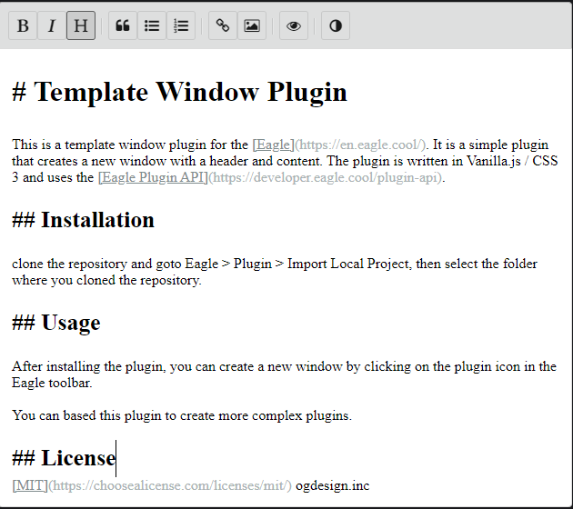
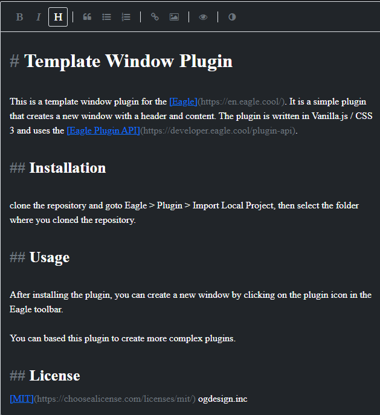

# Eagle Markdown Editor

A markdown extension for [Eagle](https://eagle.cool/) that provides a clean Markdown editor with theme support.

## Features

- 📝 Markdown editing support
- 👁️ Preview mode
- 🌓 Light/Dark theme support
- ⚡ Simple and fast

## Installation

1. Download the `.eagleplugin` package from the releases page
2. Double-click the downloaded file to install
3. Restart Eagle if needed

## Usage

The editor supports standard markdown syntax and includes a toolbar for common formatting options. Use the theme toggle button (🌓) to switch between light and dark themes.

## Acknowledgements

This plugin is built with:
* [SimpleMDE](https://github.com/sparksuite/simplemde-markdown-editor) - A simple, beautiful, and embeddable JavaScript Markdown editor

* [Bootstrap Theme](https://github.com/CoffeePerry/simplemde-theme-bootstrap-dark) - A Bootstrap-inspired dark theme for SimpleMDE
## License

MIT License

